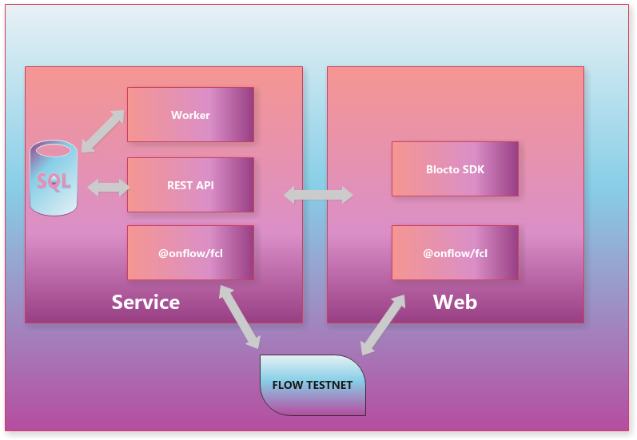

# Racing Time

## Introduction
RacingTime is the next-gen RAC game built on Flow blockchain. In addition to the Instant action feedback of drifting and nitro acceleration, RacingTime also offers unique UGC gaming experience which involves accessary collecting, car customizing and NFT trading. Players can win prizes and trophies by defeating their opponents and unlock new gadgets that further empower their futuristic super cars. Sophisticated refitting mechanism ensures the highest level of customizability; 10+ geographic conditions combining with different climates require the players to come up with smart refitting strategies in order to achieve the best possible performance.

## Project Overview


## Directory Structure

The directories here are organized into contracts, scripts, and transactions.

Contracts contain the source code for the RacingTime contracts that are deployed to Flow.

Scripts contain read-only transactions to get information about the state of someones Collection or about the state of the RacingTime contract.

Transactions contain the transactions that various admins and users can use to perform actions in the smart contract like creating rewards , minting NFTs, and transfering them.

- contracts/ : Where the RacingTime related smart contracts live.

- transactions/ : This directory contains all the state-changing transactions that are associated with the RacingTime smart contracts.

- transactions/scripts/ : This contains all the read-only Cadence scripts that are used to read information from the smart contract or from a resource in account storage.

## RacingTime Item

In our mystery boxes campaign users can select several different tiers and receive multiple exclusive rewards in return. 
Multiple NFTs can be minted from the same reward and each receives a serial number that indicates where in the edition it was minted.

Each Item is a resource object with roughly the following structure:

```
pub resource NFT{
    // global unique NFT ID
    pub let id: UInt64
    // The ID of the Reward that the NFT references
    pub let rewardID: UInt32
    // The token's type, e.g. 3 == ss
    pub let typeID: UInt32
    // The token mint number
    // Otherwise known as the serial number
    pub let serialNumber: UInt32
}
```